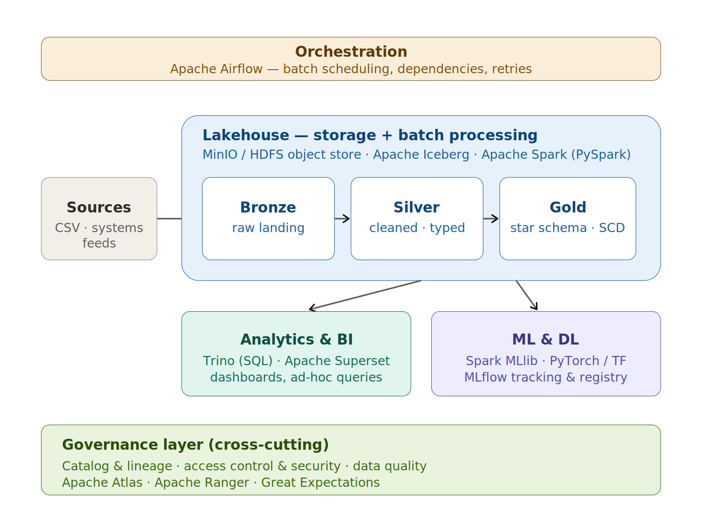
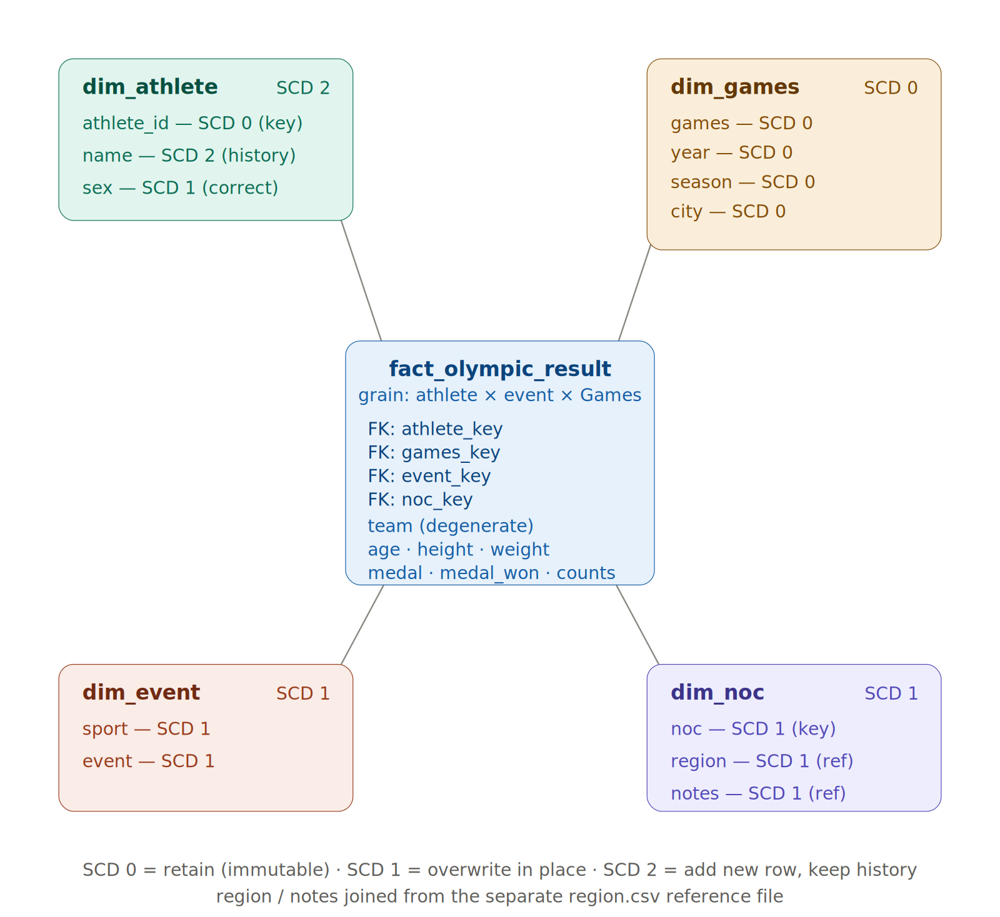

# IOC Medallion Pipeline

`ioc-medallion-pipeline` - a self-hosted, open-source **data lakehouse** and a
typed **PySpark medallion pipeline** that turns the raw Olympic athlete dataset
into a dimensional star schema with Slowly Changing Dimension (SCD) logic. Loads
are **incremental**: each run processes only the batch it is given and upserts it
into Apache Iceberg tables. The code is fully type-annotated and passes `mypy`.

---

## 1. Architecture



A self-hosted lakehouse built from open-source components - no SaaS - so
the IOC owns its data end to end. Every layer is swappable and reads open file
formats, so nothing is trapped in a proprietary system.

| Component      | Choice                                          | Why it was selected                                                                                      |
| ----------------| -------------------------------------------------| ----------------------------------------------------------------------------------------------------------|
| Storage        | MinIO (S3-compatible) or HDFS                   | On-premise object storage the IOC controls; cheap, scalable, no cloud lock-in.                           |
| Table format   | Apache Iceberg                                  | ACID transactions, schema evolution, time travel, and `MERGE` - over an open format any engine can read. |
| Processing     | Apache Spark (PySpark)                          | One engine for batch ETL **and** ML; scales from a laptop (`local[*]`) to a cluster with no code change. |
| Pattern        | Medallion (Bronze → Silver → Gold)              | Separates raw, cleaned and modelled data; gives reproducibility and clear lineage.                       |
| Orchestration  | Apache Airflow                                  | Schedules nightly batches with dependencies, retries and backfills.                                      |
| Analytics / BI | Trino + Apache Superset                         | Open SQL engine and dashboards over the Gold tables.                                                     |
| ML / DL        | Spark MLlib, PyTorch / TensorFlow, MLflow       | Same governed tables feed ML and DL training; MLflow tracks experiments and models.                      |
| Governance     | Apache Atlas, Apache Ranger, Great Expectations | Catalog & lineage, row/column access control, and per-load data-quality checks.                          |

### Executive justification (≤ 20 lines)

> I recommend a self-hosted, open-source data lakehouse rather than any SaaS
> platform, keeping the IOC in full control of its data and free of vendor
> lock-in. All athlete data stays on infrastructure the committee owns - which
> is important for sovereignty and for the long-term archival of
> the Games' historical record. A single architecture serves every workload:
> Apache Spark runs the batch pipelines that populate a dimensional model for
> analytics, and the same governed tables feed machine-learning and deep-learning
> training without the need to copy data into a separate system. Storage is inexpensive
> object storage holding open Apache Iceberg tables, so data is never trapped in a
> proprietary format. Processing follows the medallion pattern - Bronze (raw),
> Silver (cleaned), Gold (star schema) - giving reliability, reproducibility and
> end-to-end lineage. Apache Airflow orchestrates the recurring batches. Consumption
> is open too: Trino and Superset for SQL and dashboards, MLflow for models.
> Governance is built in, not bolted on: Apache Atlas catalogs every table and
> its lineage, Apache Ranger enforces fine-grained access, and Great Expectations
> validates quality on every load. The result is one auditable, future-proof
> platform the IOC owns end to end, scaling from a laptop to a cluster without
> changing a line of pipeline code.

---

## 2. Star schema & SCD specification



The fact grain is **one athlete competing in one event at one Games**. SCD type
is specified per column below. (SCD 0 = retain/immutable, SCD 1 = overwrite in
place, SCD 2 = add a new versioned row and keep history.)

| Table       | Column     | SCD type | Rationale                                                                                                                     |
| -------------| ------------| ----------| -------------------------------------------------------------------------------------------------------------------------------|
| dim_athlete | athlete_id | 0        | Natural key - never changes.                                                                                                  |
| dim_athlete | name       | **2**    | Names change (e.g. marriage); we keep which name was used historically.                                                       |
| dim_athlete | sex        | 1        | Treated as a correction - overwrite the current version.                                                                      |
| dim_games   | games      | 0        | A past Games is an immutable historical fact.                                                                                 |
| dim_games   | year       | 0        | Immutable.                                                                                                                    |
| dim_games   | season     | 0        | Immutable.                                                                                                                    |
| dim_games   | city       | 0        | Host city of a past Games never changes.                                                                                      |
| dim_event   | sport      | 1        | Reclassifications / renames overwrite.                                                                                        |
| dim_event   | event      | 1        | Naming corrections overwrite.                                                                                                 |
| dim_noc     | noc        | 1        | 3-letter code is the key; corrections overwrite.                                                                              |
| dim_noc     | region     | 1        | Country name, joined from `region.csv`; overwrite on update.                                                                  |
| dim_noc     | notes      | 1        | Historical caveat (e.g. former country), from `region.csv`.                                                                   |
| fact        | team       | -        | Degenerate dimension: team varies per participation and is not 1:1 with NOC, so it sits on the fact rather than in `dim_noc`. |

### Two source files

The pipeline ingests `athlete_events.csv` (participation records, which drive the fact
and the athlete / games / event dimensions) and `noc_regions.csv` (`NOC, region,
notes`).
Both files flow through Bronze → Silver; the regions silver table is left-joined onto
the NOC dimension when Gold is built.

`dim_athlete` is a full **SCD Type 2** merge (surrogate key, `dt_valid_from` /
`dt_valid_to`, `is_current`).
The other dimensions use a **key-stable SCD Type 1**
helper (existing surrogate keys are preserved across runs; only new business
keys mint new ones). Both live in `src/transform/scd.py`.

---

## 3. Pipeline

Tables are stored as **Apache Iceberg** in a local SQLite catalog
(`lake_root/catalog.db` + `lake_root/warehouse`). Responsibilities are split so
the transform logic stays pure and testable, and all persistence sits behind one
module.

### Project structure

```
ioc-medallion-pipeline/
├── data/
├── diagrams/                # architecture + star_schema (.svg / .png)
├── src/
│   ├── transform/           # pure DataFrame → DataFrame logic (no catalog)
│   │   ├── bronze.py
│   │   ├── silver.py
│   │   ├── scd.py
│   │   └── gold.py
│   ├── tests/
│   │   └── test_scd.py
│   ├── config.py            # config object + catalog / table identifiers
│   ├── lakehouse.py         # Iceberg catalog wiring + storage primitives
│   └── main.py              # thin orchestrator (run order only)
├── mypy.ini
├── requirements.txt
└── README.md
```

Each `__init__.py` is omitted above for brevity but present in `src/`,
`src/transform/` and `src/tests/` so the package imports (`from src.transform…`)
and `python -m src.main` resolve.

| Module | Role | Responsibility |
|---|---|---|
| `src/transform/bronze.py` | Bronze | Schema-on-read CSV ingestion; lineage columns (`_ingested_at`, `load_ts`). |
| `src/transform/silver.py` | Silver | Type casts, `"NA"` medal → `NULL`, trim, grain `participation_id`. |
| `src/transform/scd.py`    | transforms | SCD Type 2 merge + key-stable SCD Type 1 helper (pure; no catalog). |
| `src/transform/gold.py`   | Gold | Builds the star schema (dimensions + fact); SCD applied here. |
| `src/lakehouse.py` | storage | Iceberg catalog wiring + `append` / `upsert` (`MERGE`) / `overwrite_dim`. |
| `src/main.py`   | orchestration | Thin: decides the order Bronze → Silver → Gold for one batch. |
| `src/config.py` | config | Single config object; catalog, warehouse and table identifiers. |

### Incremental, MERGE-based loads

Each run processes **only the batch passed in**, not all of history:

- **Bronze** appends the raw batch (append-only, immutable; re-reading a batch
  duplicates rows by design). Partitioned by `days(load_ts)`.
- **Silver** cleans that batch and **upserts** it - matching on
  `participation_id` (a hash of the grain `athlete_id, games, sport, event`),
  newest `load_ts` winning on conflict. Partitioned by `year`.
- **Gold** dimensions are merged from the batch into the existing (small) tables
  and overwritten; the **fact** is upserted on `participation_id` into its `year`
  partitions.

Re-sending a corrected participation updates it in place rather than
duplicating. A full rebuild remains possible by replaying every Bronze batch into
a fresh `--lake`.

**Timestamps.** `load_ts` is set automatically by the driver at run start and drives
the upsert tiebreaker. `--dt_valid_from` (valid time) is an optional business date for
SCD2 effective ranges; it defaults to the ingestion date and is passed explicitly only
for backfills.

### Run it

```bash
pip install -r requirements.txt   # Iceberg + SQLite JDBC jars fetch on first run

python -m src.main --source data/athlete_events.csv --regions data/noc_regions.csv --lake ./lakehouse

python -m src.main --source data/athlete_events.csv --regions data/noc_regions.csv --lake ./lakehouse --dt_valid_from 2025-01-01
```

### Type check & test

Run both from the **project root** (so `src` resolves as a package):

```bash
mypy --config-file mypy.ini          # files = src in the config -> Success: no issues found
python -m src.test.test_scd          # SCD2 history + SCD1 key-stability checks
```

---

## Notes & known limitations

- **Fact ↔ dimension linkage.** The fact joins to the **current** version of
  each dimension via its surrogate key - simple and correct for a rebuilt star.
  The rigorous SCD2 variant joins on the dimension version whose
  `dt_valid_from`/`dt_valid_to` window contains the Games date.
- **SCD2 assumes in-order arrival** (each batch's `--as-of` ≥ all prior). The
  fact upsert is order-independent (newest `load_ts` wins); late-arriving
  out-of-order *dimension* history is out of scope.
- **Dimensions are full read-modify-write** (fine at athlete-data scale; revisit
  for very large dimensions). Surrogate keys are sequential integers, stable on
  upsert but not concurrency-safe.